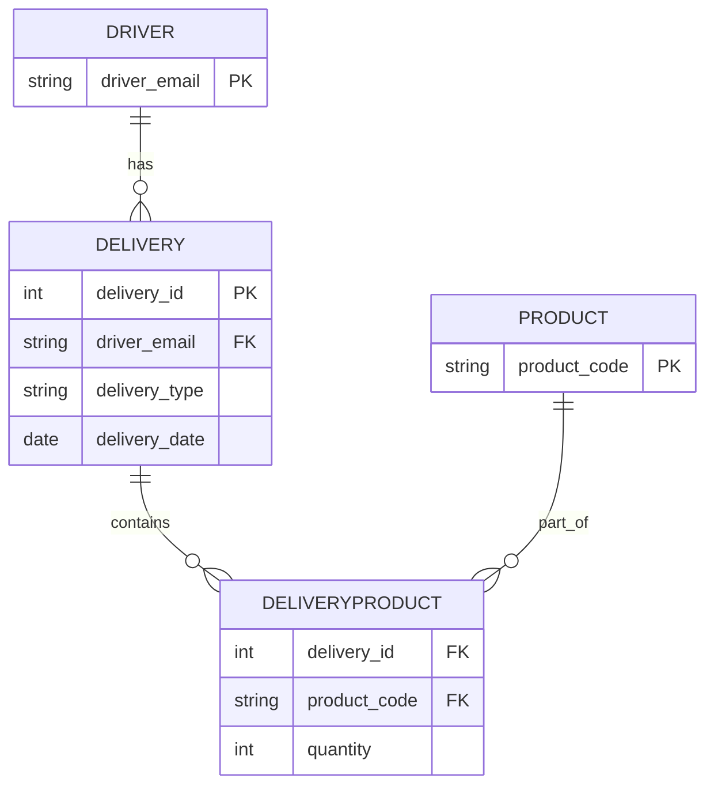

## Clearpoint Software Dev Assessment

### Question 1 - Data Model

Following is a minimal ER diagram based on the given information. 

DRIVER_EMAIL and PRODUCT_CODE are used as primary keys instead of using separate IDs for the DRIVER and PRODUCT tables as a design decision to keep it simple and efficient at this stage.



#### Database Query
```sql
SELECT d.driver_email, de.delivery_type, SUM(dp.quantity) AS quantity_of_all_products
FROM Driver d
INNER JOIN Delivery de ON d.driver_email = de.driver_email
INNER JOIN DeliveryProduct dp ON de.delivery_id = dp.delivery_id
WHERE 
    de.delivery_date = '2021-09-21'
GROUP BY d.driver_email, de.delivery_type
ORDER BY d.driver_email, de.delivery_type;

```

